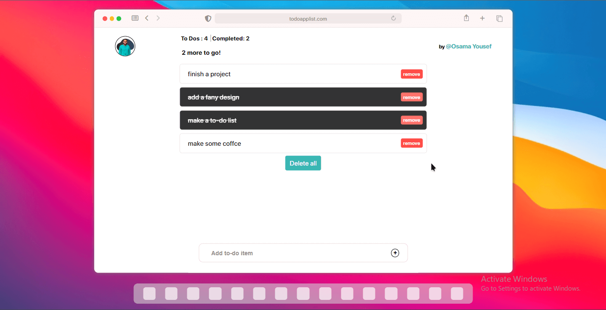

# Welcome to TO-DO List

TO-DO List is a simple and responsive web app that allows you to organize your daily tasks. It uses local storage to store your data, ensuring that your TO-DO List is always available, even if the app is closed.

## Features:

- Local storage: Your TO-DO List is stored locally, ensuring that your data is always available, even if the app is closed or if you switch devices.
- Easy-to-use interface: The app is designed to be simple to use, with intuitive controls to add, delete, and edit tasks.
- Responsive design: The app is responsive, ensuring that it looks great on all devices, from mobile phones to desktops.
- Performance optimized: The app is optimized for performance, ensuring that it runs smoothly and efficiently, even on slower connections.

## Getting Started:

1. Open TO-DO List in your browser.
2. Click on the "New Task" button to add a task to your TO-DO List.
3. Type in the task, and then click on the "Add" button.
4. To delete a task, click on the task, and then click on the "Delete" button.
5. To edit a task, click on the task, and then edit the text.
6. To view your TO-DO List, click on the "See List" button.

## Technical Details:

- Front-end technologies: HTML, CSS, JavaScript
- Back-end technologies: JSON
- Database: Local storage

## Conclusion:

TO-DO List is a simple and responsive web app that provides an easy way to organize your daily tasks. With its use of local storage, your data is always available, even if the app is closed or if you switch devices. The app is designed with a focus on performance, ensuring that it runs smoothly and efficiently, even on slower connections.

## preview project image :

## Live Demo : https://osamayouseff.github.io/TO_DO_List/
